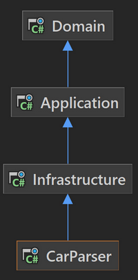
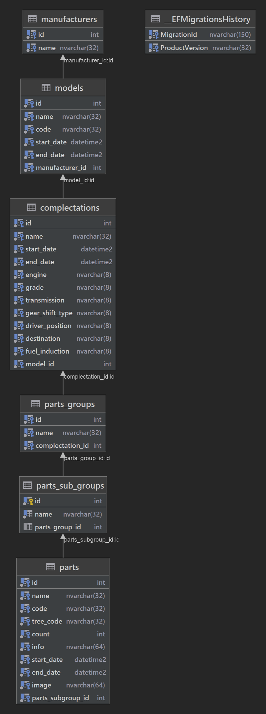

# Abp Car Parser
Web scrapper for https://www.ilcats.ru/
### Repository
1. **[src]** - solution
2. **[sql]** - sql scripts (create db and test data)
3. **[assets]** - images
### Project
1. **Domain** - domain of parser, entities and base business logic
2. **Application** - application layer: use case (parse)
3. **Infrastructure** - infrastructure layer: sql server, parsers etc
4. **CarParser** - console application for parsing
### Architecture
#### Project

#### Database

### How Use
Run console application with argument
```
dotnet CarParser.dll Url="url_to_manufacturer_models_page"
```
Supported only Toyota manufacturer
### For Developers
#### Work with migrations
From Infrastructure directory
```
dotnet ef migrations add NAME --startup-project "..\CarParser\CarParser.csproj"
dotnet ef database update --startup-project "..\CarParser\CarParser.csproj"
```
#### Configuration (appsettings.json)
Near executable file (example below)
```json
{
    "Logging": {
        "LogLevel": {
            "Default": "Debug",
            "System": "Information",
            "Microsoft": "Information",
            "Microsoft.Hosting.Lifetime": "Warning"
        }
    },
    "ConnectionStrings": {
        "CarDbConnection": "YOUR_CONNECTION_STRING_TO_MSSQL"
    }
}
```